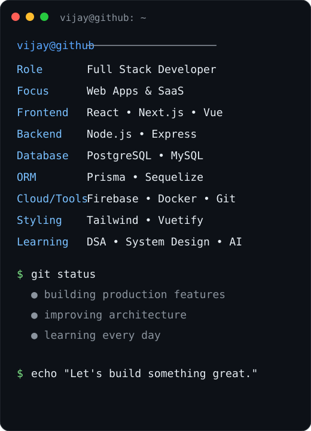

# `vijay@github ~ $ whoami`

### Full Stack Developer · React · Next.js · Node.js · PostgreSQL

  
  

<h3><code>vijay@github ~ $ ./contributions.sh</code></h3>

  

<h3><code>vijay@github ~ $ neofetch</code></h3>

<table>
<tr>
<td valign="top">

</td>
<td valign="top">

</td>
</tr>
</table>

---

## `vijay@github ~ $ cat about.txt`

I'm a **Full Stack Developer** who enjoys turning ideas into production-ready web applications.

- 🚀 Building modern web apps and SaaS products
- ⚛️ React / Next.js / Vue on the frontend
- 🟢 Node.js / Express on the backend
- 🐘 PostgreSQL / MySQL with Prisma and Sequelize
- ☁️ Firebase, Docker and modern deployment workflows
- 🧠 Currently sharpening DSA, System Design and GenAI

## `vijay@github ~ $ tech-stack`

## `vijay@github ~ $ connect`

> **Note:** The contribution heatmap is generated locally and refreshed automatically by GitHub Actions. It uses GitHub's public contribution calendar, so no personal access token is required.

