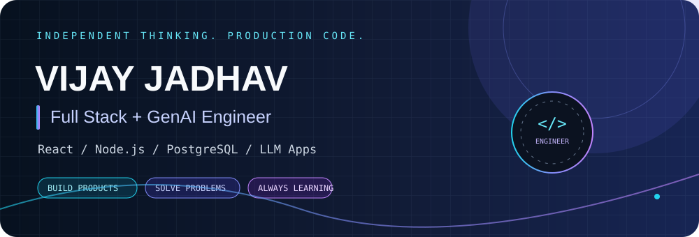
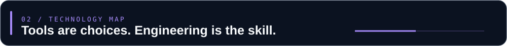
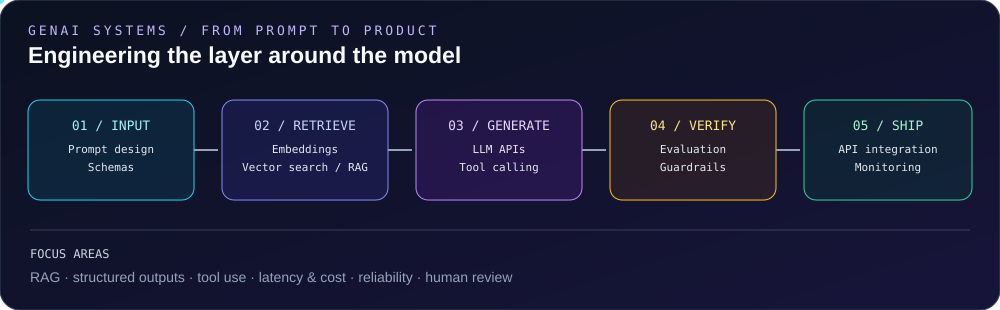
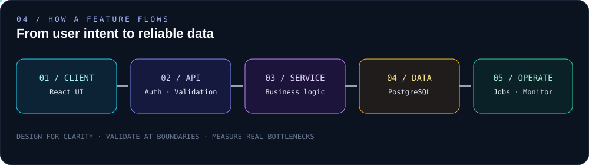
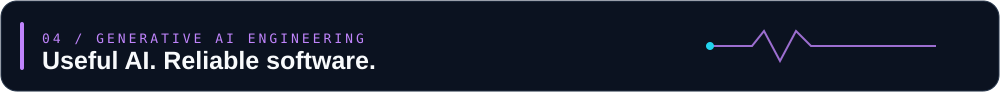
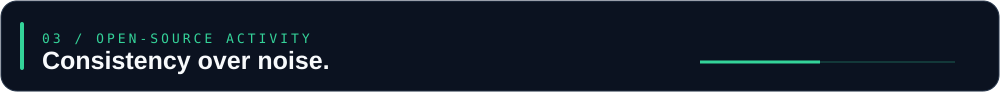
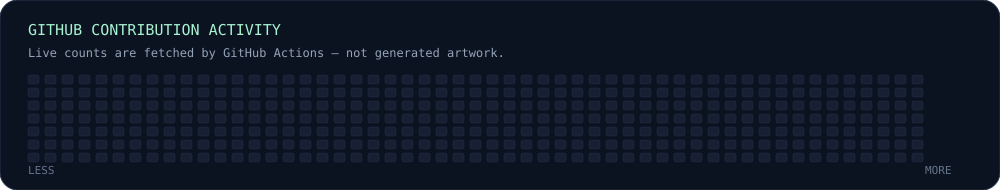

**FULL STACK ENGINEERING  ×  GENERATIVE AI**

Building web products and practical AI-powered workflows — from UI and APIs to LLM integrations.

<table>
<tr>
<td width="50%"></td>
<td width="50%"></td>
</tr><tr>
<td width="50%"></td>
<td width="50%"></td>
</tr>
</table>

**GENAI TOOLKIT**

`LLM APIs` · `Prompt Design` · `Structured Outputs` · `Tool Calling` · `RAG` · `Embeddings` · `Vector Search` · `Evaluation` · `Guardrails`

**Build. Learn. Ship. Improve.**

